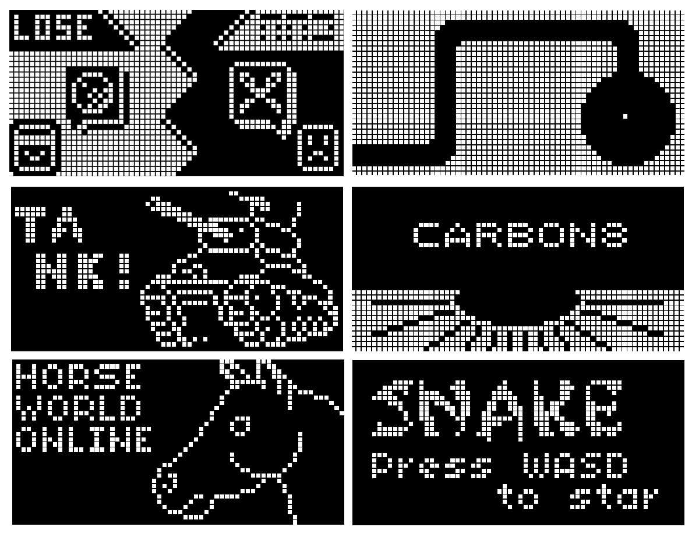

# chip8-emulator
A [CHIP-8](https://en.wikipedia.org/wiki/CHIP-8) emulator written in Rust.

<p align="center"></p>

## Example
```rust
mod chip8;
mod sdl_platform;

pub fn main() {   
    let mut emulator = chip8::Emulator::new();
    emulator.load_program_from_file("example.ch8");
    let mut platform = sdl_platform::SDLPlatform::new();
    platform.run(&mut emulator);
}
```
## Useful links
* http://devernay.free.fr/hacks/chip8/C8TECH10.HTM#8xy2
* https://tobiasvl.github.io/blog/write-a-chip-8-emulator/#timers
* http://johnearnest.github.io/Octo/docs/XO-ChipSpecification.html
